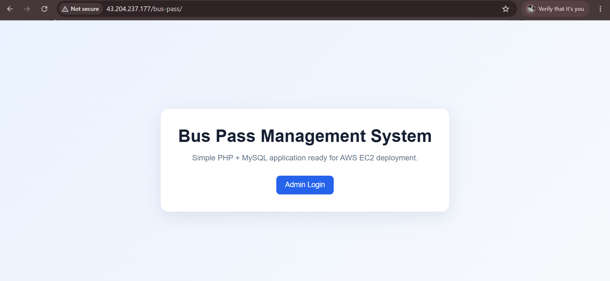
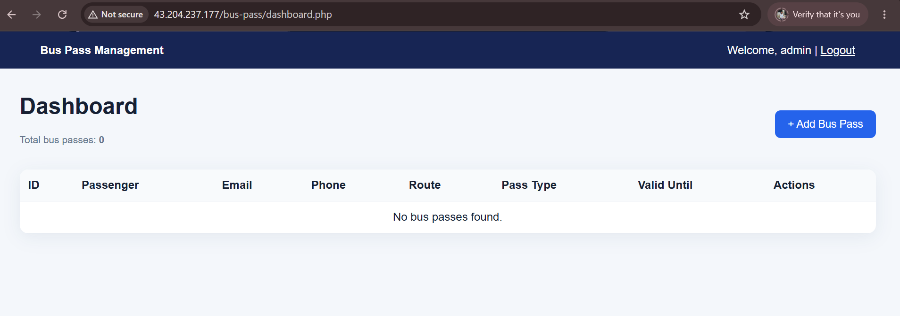

# Bus Pass Management System

A web-based Bus Pass Management System developed with PHP and MySQL to manage passenger bus pass records through an administrator dashboard.

## Features

- Administrator authentication with session management
- Add, view, edit, and delete bus pass records
- MySQL database integration
- Server-side form validation
- Prepared SQL statements
- Responsive user interface
- AWS EC2 deployment support

## Tech Stack

- **Frontend:** HTML, CSS
- **Backend:** PHP
- **Database:** MySQL
- **Web Server:** Apache
- **Cloud:** AWS EC2
- **Version Control:** Git, GitHub

## Project Structure

```text
├── assets/
│   └── style.css
├── index.php
├── login.php
├── dashboard.php
├── add_pass.php
├── edit_pass.php
├── delete_pass.php
├── logout.php
├── config.php
└── database.sql
```

## Setup

### 1. Clone the repository

```bash
git clone https://github.com/YOUR-USERNAME/YOUR-REPOSITORY.git
cd YOUR-REPOSITORY
```

### 2. Configure MySQL

Create the database and import the provided SQL file:

```bash
mysql -u root -p < database.sql
```

Then update `config.php` with your database credentials:

```php
$host = "localhost";
$db   = "bus_pass_db";
$user = "your_database_user";
$pass = "your_database_password";
```

### 3. Run the application

Place the project in your Apache web root and open:

```text
http://localhost/YOUR-REPOSITORY/
```

## AWS EC2 Deployment

Install Apache, PHP, MySQL, and Git on Ubuntu:

```bash
sudo apt update
sudo apt install apache2 php libapache2-mod-php php-mysql mysql-server git -y
```

Clone and deploy the project:

```bash
git clone https://github.com/YOUR-USERNAME/YOUR-REPOSITORY.git
sudo cp -r YOUR-REPOSITORY/* /var/www/html/
```

Configure MySQL and `config.php`, then restart Apache:

```bash
sudo systemctl enable apache2
sudo systemctl restart apache2
```

Access the application:

```text
http://YOUR-EC2-PUBLIC-IP
```

## Security

- Never commit database passwords, private keys, or `.env` files.
- Use strong administrator and database passwords.
- Restrict SSH access to trusted IP addresses.
- Use HTTPS for production deployments.

## Screenshots


## Screenshots

### Homepage


###  Admin Login


### Dashboard


### Adding Pass


### Added Pass


### Delete User


### User Deleted
